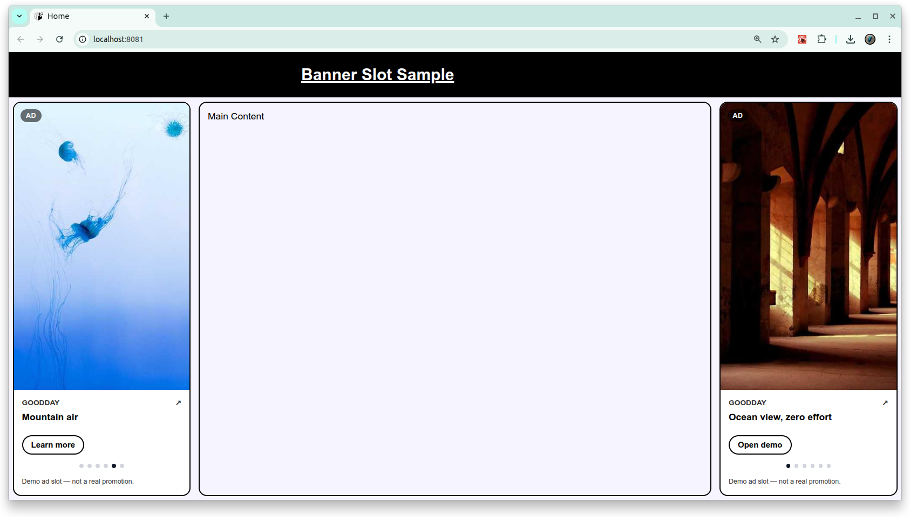

# [Bannter Slot](https://github.com/europanite/banner-slot "Bannter Slot")

[](https://opensource.org/licenses/Apache-2.0)




## OverView

A small rotating banner UI for **React Native / Expo / React Native Web**.

- ✅ **Sidebar-style** slot or **Inline** slot
- ✅ **Rotating banners** (cross-fade)
- ✅ **Clickable CTA** that opens a URL (default: `Linking.openURL`)
- ✅ **Works on GitHub Pages** (exported web build)


---

## 🚀 Getting Started

## Install

```bash
npm i banner-slot
# or
pnpm add banner-slot
# or
yarn add banner-slot
```

**Peer deps** (your app side):
- `react`
- `react-native` (Expo OK)
- `react-native-web` (for Web)


## Development

```bash
npm install
npm run build
npm test
```

## Publishing

1. Verify entrypoint + build output
- build produces ESM/CJS + `.d.ts` in `dist/`

2. Make sure your package contents are correct
```bash
npm pack
# inspect the generated .tgz (it should include dist/*, README, LICENSE, etc.)
```

3. Login & publish
```bash
npm login
npm publish
```

If you use a scoped name (e.g. `@your-scope/banner-slot`) and it should be public:
```bash
npm publish --access public
```

4. Tag a release (recommended)
```bash
git tag v0.1.0
git push --tags
```

---

# License
- Apache License 2.0